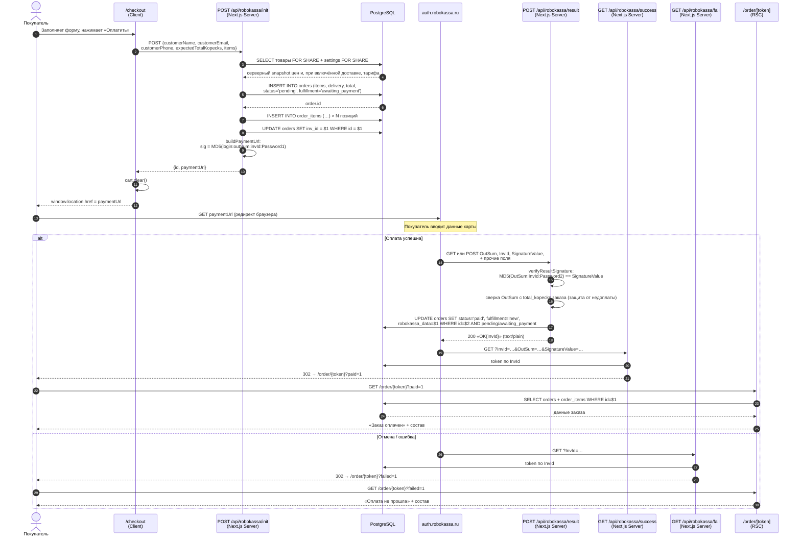
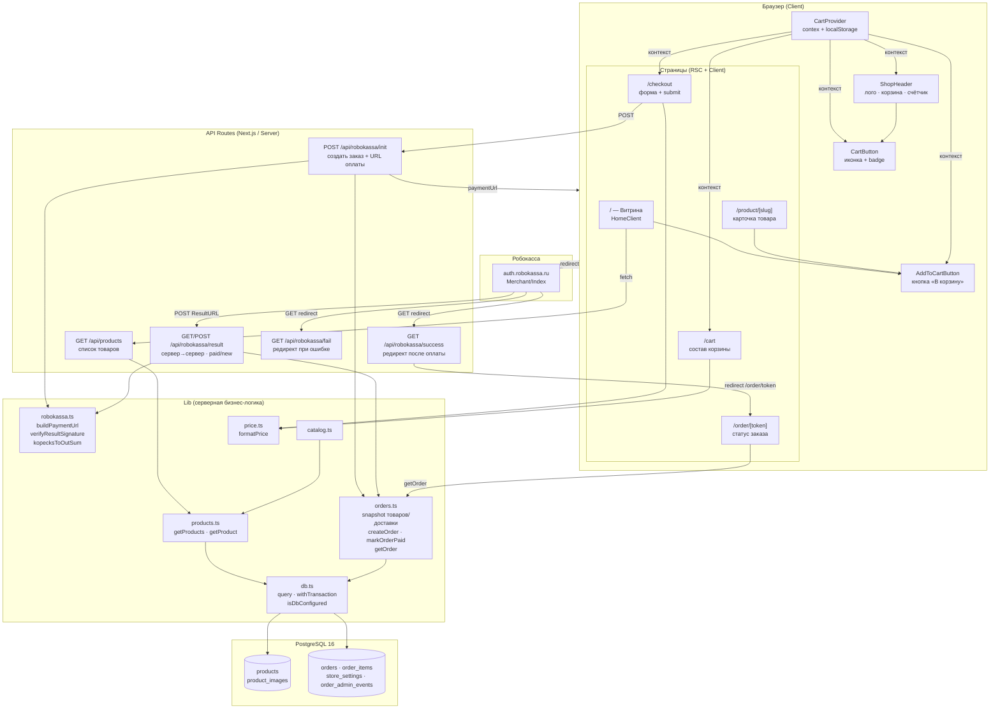

# Архитектура компонентов — МАВИТА Магазин

---

## Sequence-диаграмма флоу оплаты

## Пояснения к шагам

| # | Кто → Кто | Метод / тип | Входные данные | Выходные данные | Примечание |
|---|---|---|---|---|---|
| 1 | Покупатель → `/checkout` | UI-событие | Форма: ФИО, email, телефон, корзина из localStorage | — | Корзина читается из `CartProvider` (localStorage) |
| 2 | `/checkout` → `/api/robokassa/init` | `POST JSON` | `{customerName, customerEmail, customerPhone, expectedTotalKopecks, items}`; при включённом СДЭК ещё ПВЗ и expected delivery | — | Клиентские суммы — только optimistic-ожидание; сервер их сверяет |
| 3 | `/api/robokassa/init` → PostgreSQL | транзакция | `slug[]`, при включённой доставке — тариф | заблокированный snapshot | Авторитетный каталог и тариф; цена клиента игнорируется |
| 4 | `/api/robokassa/init` → PostgreSQL | SQL INSERT | customer, items/delivery/total, `pending/awaiting_payment` | `order.id` | Заказ создаётся до редиректа в платёжку |
| 5 | `/api/robokassa/init` → PostgreSQL | SQL INSERT × N | `order_id, product_id, product_name, price_kopecks, quantity` | — | Snapshot цены и названия на момент покупки |
| 6 | `/api/robokassa/init` → PostgreSQL | SQL UPDATE | `inv_id = order.id` | — | У Робокассы `InvId` = `order.id`; поле заполняется сразу |
| 7 | `/api/robokassa/init` внутри | MD5 | `MerchantLogin:OutSum:InvId:Password1` | `SignatureValue` | `Password1` — секрет только на сервере, никогда клиенту |
| 8 | `/api/robokassa/init` → `/checkout` | `201 JSON` | — | `{id, paymentUrl}` | `paymentUrl = null` если Робокасса не сконфигурирована — тогда редирект сразу на `/order/{token}` |
| 9 | `/checkout` | JS | — | — | `cart.clear()` из контекста чистит localStorage |
| 10 | Покупатель → Робокасса | Browser redirect | `paymentUrl` (GET с параметрами + подписью) | — | `window.location.href` — полный переход, не fetch |
| 11 | Робокасса → `/api/robokassa/result` | GET или POST | `OutSum, InvId, SignatureValue` + дополнительные поля | — | **Сервер → сервер**, браузер покупателя не участвует |
| 12 | `/api/robokassa/result` внутри | MD5 verify | `OutSum:InvId:Password2` | `bool` | `Password2` ≠ `Password1` — разные секреты для разных сторон |
| 13 | `/api/robokassa/result` → PostgreSQL | транзакционный UPDATE | `paid/new`, `robokassa_data`, id | — | Переход из `pending/awaiting_payment` идемпотентен и не смешивает оплату с отгрузкой |
| 14 | `/api/robokassa/result` → Робокасса | `200 text/plain` | — | `«OK{InvId}»` | Робокасса ждёт именно эту строку; иначе будет повторять колбэк |
| 15 | Робокасса → `/api/robokassa/success` | `GET` | `InvId, OutSum, SignatureValue` | — | Параллельно с #11, но уже для браузера покупателя |
| 16 | `/api/robokassa/success` → браузер | `302 redirect` | — | `/order/{token}?paid=1` | `?paid=1` — только UX-флаг, не источник правды о статусе |
| 17 | Покупатель → `/order/[token]` | `GET` (RSC) | `id` из URL | — | Страница SSR-читает заказ из БД |
| 18 | `/order/[token]` → PostgreSQL | SQL SELECT | `order.id` | `order + order_items` | Статус отображается из БД — `paid` уже проставлен на шаге #13 |
| — | Робокасса → `/api/robokassa/fail` | `GET` | `InvId` | `302 → /order/{token}?failed=1` | Только при отмене или ошибке оплаты; `status` в БД остаётся `pending` |

---

## Слои и ответственность

| Слой | Компоненты | Ответственность |
|---|---|---|
| **Browser / Client** | `CartProvider`, `CartButton`, `AddToCartButton`, `ShopHeader` | Состояние корзины в localStorage, UI |
| **Pages (RSC)** | `page.tsx` × 5 | Server-side рендер, получение данных через `lib/` |
| **API Routes** | `/api/products`, `/api/robokassa/*`, `/api/checkout/delivery`, `/api/cdek` | HTTP-граница, валидация ввода, роутинг |
| **Lib** | `orders.ts`, `robokassa.ts`, `catalog.ts`, `products.ts`, `price.ts`, `store-settings.ts` | Бизнес-логика, без HTTP-зависимостей, покрыта тестами |
| **DB** | `db.ts` → PostgreSQL | Персистентность; цены только в копейках (`INTEGER`) |

Пошаговый флоу оплаты — в sequence-диаграмме и таблице выше.

> Диаграммы выше покрывают **публичный флоу покупки**. Админ-панель (Ф4, компонент 1)
> вынесена отдельно ниже.

---

## Админ-панель (Ф4, компонент 1 — реализована)

Защищённый контур управления каталогом. Спецификация — [docs/specs/done/admin-products.md](docs/specs/done/admin-products.md).

| Слой | Компоненты | Ответственность |
|---|---|---|
| **Pages** | `app/admin/login`, `app/admin/(protected)/*` (список, создание, редактирование) | Вход по паролю + UI каталога; `requireAdminPage()`-гард |
| **API Routes** | `app/api/auth/login\|logout`, `app/api/admin/products/**` (CRUD, reorder, images), `app/api/upload` | `requireAdminApi()` + same-origin (**I8**); загрузка фото файл + `product_images` атомарно (**I5**) |
| **Lib** | `auth.ts` (iron-session, гарды, `assertSameOrigin`), `pricing.ts` (эффективная цена/скидка), `catalog.ts` (фильтр видимости), `admin-products-db.ts`, `slug.ts` | Авторизация и серверная бизнес-логика админки |

Инварианты контура: **I8** (гард + same-origin по хосту за прокси, см. `docs/decisions.md`),
**I9** (серверная эффективная цена в snapshot заказа), **I5** (атомарная загрузка фото).

Компонент 2 (заказы, delivery snapshot, **I10**) реализован в репозитории:
`/admin/orders`, `/admin/settings/delivery`, admin API и миграция `003`.
Текущий rollout держит `DELIVERY_ENABLED=false`, поэтому платёжный флоу проверяется
без ПВЗ. Включение СДЭК и OAuth-ключей — отдельный следующий этап:
[docs/specs/done/admin-orders.md](docs/specs/done/admin-orders.md).
